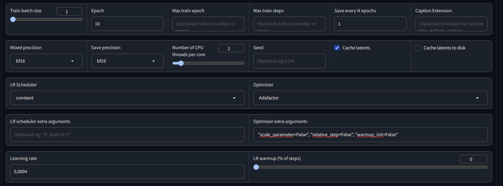
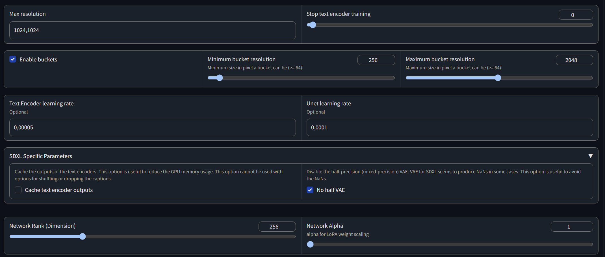
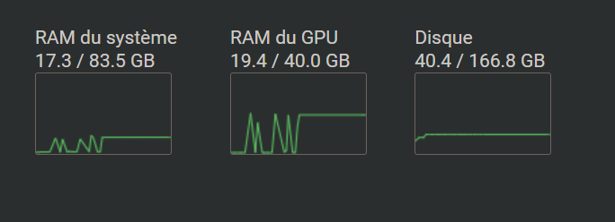
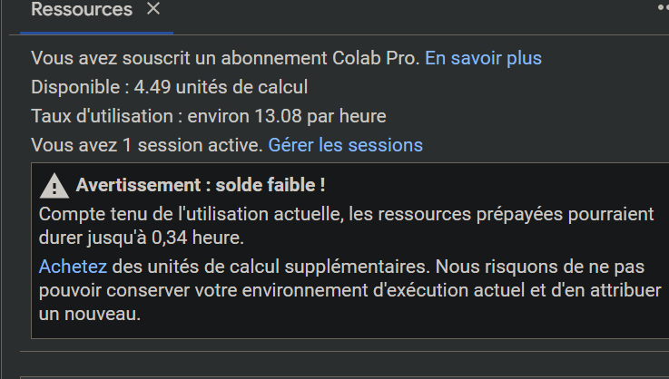
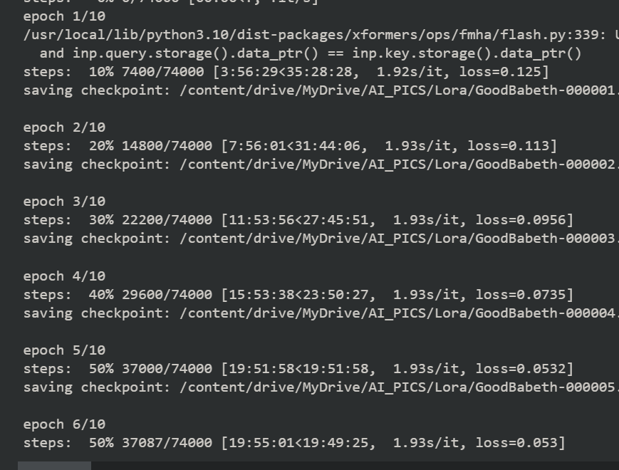

# StableDiffusion

## colab book

https://colab.research.google.com/github/sagiodev/SDA-lora-training/blob/main/LoRA_trainer_kohya_ss_SDA.ipynb

## github reference

https://github.com/bmaltais/kohya_ss

## hugging face

https://huggingface.co/stabilityai/stable-diffusion-xl-base-1.0/tree/main/sd_xl_base_1.0.safetensors

## download sdxl model to colab

Script 1

```python
!cd ../sample_data/

from huggingface_hub import notebook_login
notebook_login()
from huggingface_hub import hf_hub_url

myPath=  hf_hub_url(
    repo_id="stabilityai/stable-diffusion-xl-base-1.0", filename="sd_xl_base_1.0.safetensors"
)
!wget $myPath
!cd ../kohya_ss   
!mv sd_xl_base_1.0.safetensors ../sample_data/
```

Script 2

```python

from huggingface_hub import hf_hub_url

myPath=  hf_hub_url(
    repo_id="stabilityai/stable-diffusion-xl-base-1.0", filename="sd_xl_base_1.0.safetensors"
)
!wget -P /content/sample_data $myPath
```


## parameters 

[link](https://www.youtube.com/watch?v=AY6DMBCIZ3A)

Pretrained model name or path
/content/sample_data/sd_xl_base_1.0.safetensors

/content/drive/MyDrive/AI_PICS/training/elisabeth_borne_512px

#optimizer extra argument
Adafactor
"scale_parameter=False", "relative_step=False", "warmup_init=False"





## training command

[link](https://github.com/FurkanGozukara/Stable-Diffusion/blob/main/Tutorials/How-To-Install-And-Use-Kohya-GUI-And-Do-Ultra-Realistic-SDXL-Training-Tutorial.md)

accelerate launch --num_cpu_threads_per_process=2 "./sdxl_train_network.py" --enable_bucket --pretrained_model_name_or_path="F:/0 models/sd_xl_base_0.9.safetensors" --train_data_dir="F:/kohya sdxl tutorial files\img" --reg_data_dir="F:/kohya sdxl tutorial files\reg" --resolution="1024,1024" --output_dir="F:/kohya sdxl tutorial files\model" --logging_dir="F:/kohya sdxl tutorial files\log" --network_alpha="1" --save_model_as=safetensors --network_module=networks.lora --text_encoder_lr=0.0004 --unet_lr=0.0004 --network_dim=256 --output_name="tutorial_video" --lr_scheduler_num_cycles="10" --no_half_vae --learning_rate="0.0004" --lr_scheduler="constant" --train_batch_size="1" --max_train_steps="5200" --save_every_n_epochs="1" --mixed_precision="bf16" --save_precision="bf16" --cache_latents --cache_latents_to_disk --optimizer_type="Adafactor" --optimizer_args scale_parameter=False relative_step=False warmup_init=False --max_data_loader_n_workers="0" --bucket_reso_steps=64 --gradient_checkpointing --xformers --bucket_no_upscale

## output first training

Max train Steps


RAM & GPU



Ressources



Epoch timing



## GPU profiling

[Increase the batch size](https://medium.com/mini-distill/effect-of-batch-size-on-training-dynamics-21c14f7a716e)

[Link](https://towardsdatascience.com/a-batch-too-large-finding-the-batch-size-that-fits-on-gpus-aef70902a9f1) 

The proper method to find the optimal batch size that can fully utilize the accelerator is via GPU profiling, a process to monitor processes on the computing device.

[pytorch profiler](https://pytorch.org/tutorials/recipes/recipes/profiler_recipe.html)
